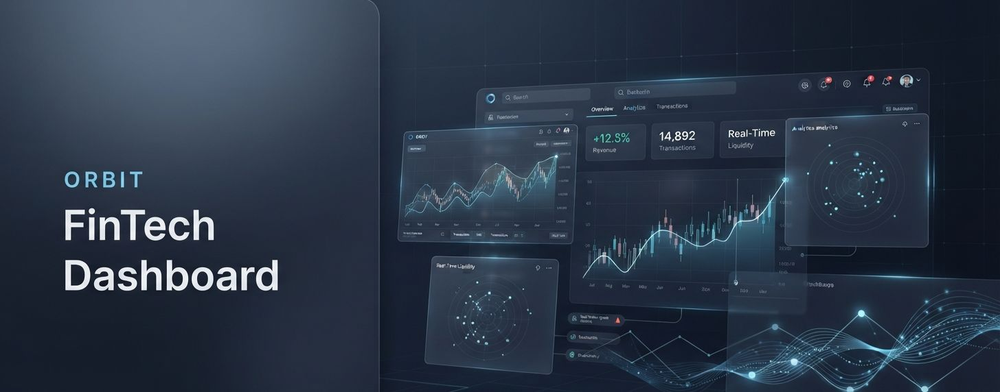
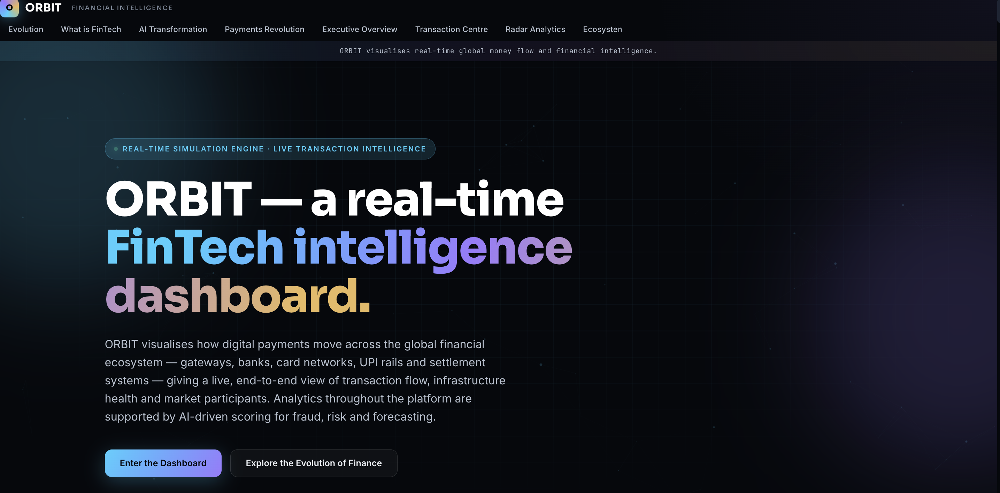
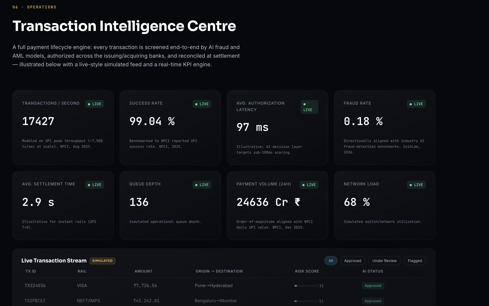
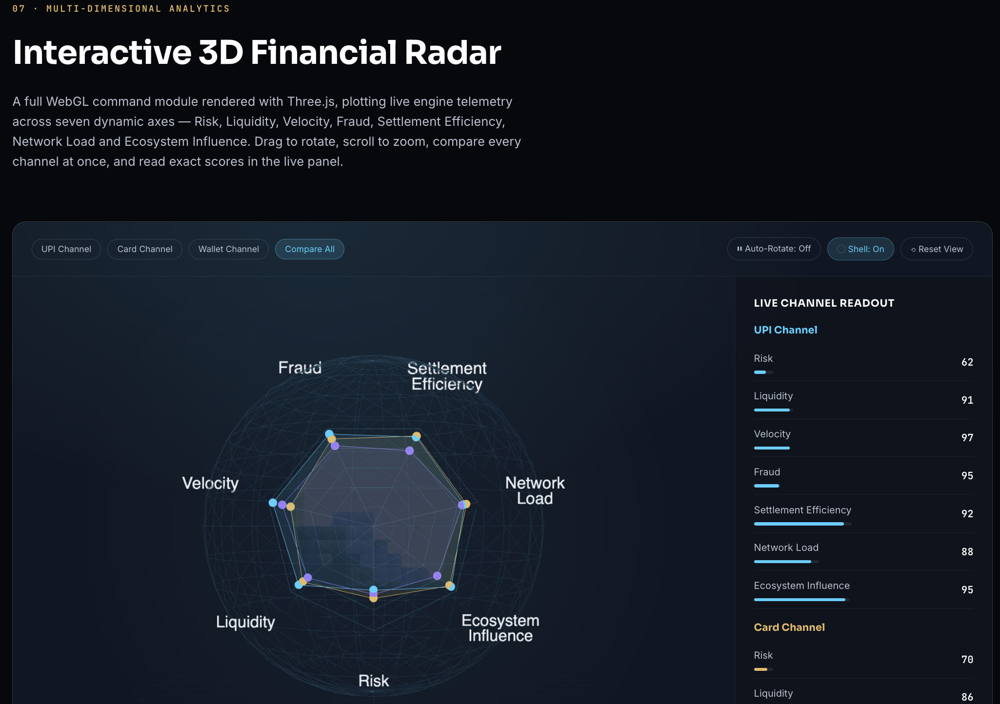
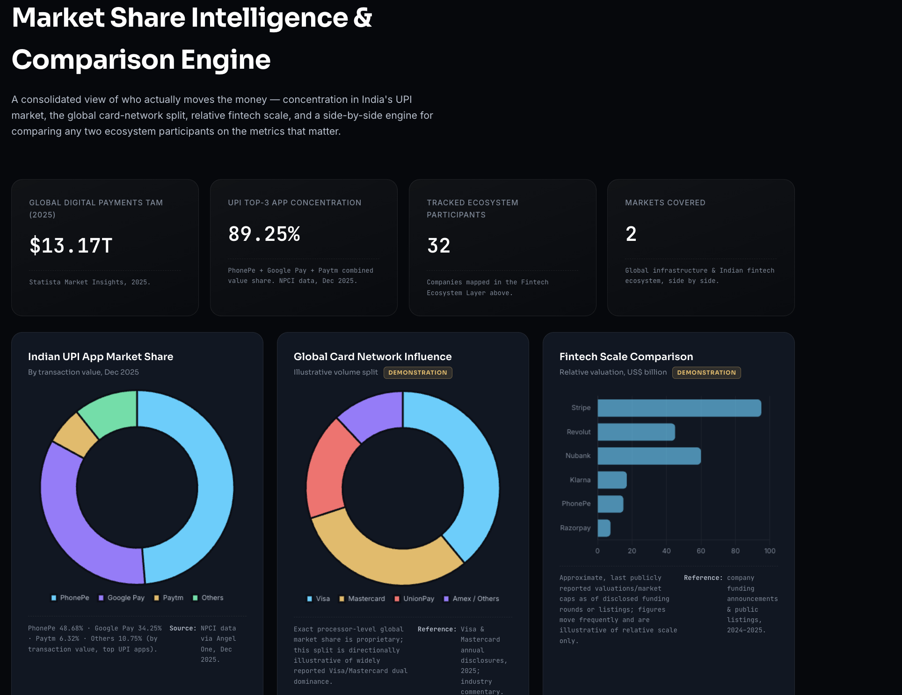

# ORBIT FinTech Dashboard 📊

---

## 1. Project Links

1. 👉 Live Demo: https://urstrulyghc-5.github.io/orbit-fintech-dashboard/  
2. 👉 GitHub Repository: https://github.com/urstrulyghc-5/orbit-fintech-dashboard  

---

## 2. Project Overview

1. ORBIT FinTech Dashboard is a modern financial analytics and visualization platform.  
2. It is designed to represent transaction flows, key performance indicators, and financial ecosystem insights in a structured and interactive manner.  
3. The project focuses on clarity, scalability, and professional-grade UI design for fintech applications.  

---

## 3. Developer Information

1. Name: G Hari Charan  
2. Qualification: MBA in Finance and Business Analytics  
3. Objective: To demonstrate practical skills in financial data visualization, dashboard development, and frontend engineering for real-world fintech systems.  

---

## 4. Project Purpose

1. To convert complex financial data into structured visual insights.  
2. To demonstrate UI/UX design and frontend development skills.  
3. To showcase financial analytics understanding.  
4. To build a scalable and modular fintech dashboard system.  

---

## 5. Key Features

1. Interactive financial dashboard interface with structured layout  
2. Transaction flow visualization system for financial tracking  
3. KPI monitoring and performance analytics modules  
4. Radar-based financial ecosystem visualization  
5. Modular and scalable frontend architecture  
6. Responsive design optimized for desktop environments  

---

## 6. Design Philosophy

1. Minimal and enterprise-grade fintech UI design approach  
2. Inspired by modern SaaS and financial analytics platforms  
3. Focus on clarity, structure, and usability  

---

## 7. Core Design Principles

1. Clean and structured data representation  
2. Strong visual hierarchy  
3. Consistent UI components  
4. Professional fintech aesthetics  
5. Performance-oriented layout design  

---

## 8. Project Structure
ORBIT-FinTech-Dashboard/
├── index.html
├── style.css
├── script.js
├── docs/
│ │ ├── banner.png
│ │ ├── dashboard-overview.png
│ │ ├── transaction-intelligence.png
│ │ ├── radar.png
│ │ ├── analytics-view.png
│ ├── PROJECT_OVERVIEW.md

---

## 9. Screenshots

1. Dashboard Overview  
   

2. Transaction Intelligence  
   

3. Radar Visualization  
   

4. Analytics View  
   

---

## 10. Technologies Used

1. HTML5  
2. CSS3  
3. JavaScript  
4. Data visualization design principles  
5. Responsive web design techniques  

---

## 11. Future Enhancements

1. Real-time data integration  
2. AI-driven financial insights  
3. Backend API connectivity  
4. Advanced predictive analytics  
5. Performance optimization for large datasets  

---

## 12. Sources and References

1. Modern fintech dashboard UI patterns used in enterprise analytics systems  
2. Financial visualization practices used in banking and trading platforms  
3. SaaS design principles inspired by enterprise platforms such as Stripe-style interfaces  
4. Standard frontend development practices for interactive dashboard systems  

Note: No external proprietary code or datasets have been used. This project is independently developed for educational and portfolio purposes.

---

## 13. License

1.This project is licensed under the MIT License.
2.See the LICENSE file in this repository for full details.
---

## 14. Conclusion

1. ORBIT FinTech Dashboard demonstrates the integration of financial analytics with modern frontend engineering.  
2. It serves as a scalable foundation for advanced financial visualization systems.  
3. It highlights UI design, data structuring, and system thinking in fintech applications.
